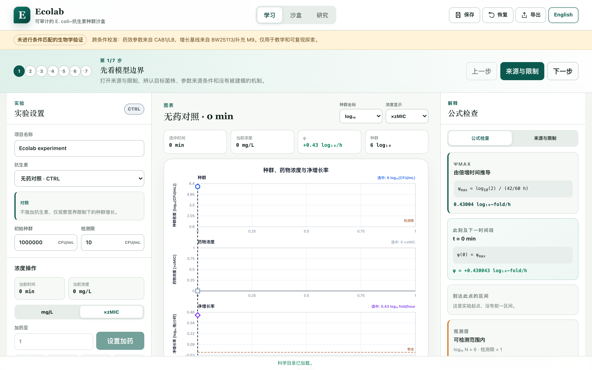

**目录：**

- [中文版](README.md)
- [英文版](README.en.md)
- [日文版](README.ja.md)

# Ecolab 6.0.0



Ecolab 是一个本地优先、可审计、可复现的 *E. coli*–抗生素种群建模项目，包含中英文 Learn / Sandbox 与真实数据 Research Workspace。

> 用于教学、模型探索和研究型分析；不是临床决策工具，也不是经过条件匹配验证的通用实验预测器。

## 阅读导航

- [在线网站](#在线网站) · [版本契约](#版本契约) · [命令](#命令)
- [代码原理](#代码原理)
  - [1. 分层结构与调用链](#1-分层结构与调用链)
  - [2. 教学模型与分段解析计算](#2-教学模型与分段解析计算)
  - [3. 真实数据导入与观测层](#3-真实数据导入与观测层)
  - [4. 拟合优化与模型比较](#4-拟合优化与模型比较)
  - [5. 参数扫描与敏感性分析](#5-参数扫描与敏感性分析)
  - [6. 不确定性与可识别性](#6-不确定性与可识别性)
  - [7. 浏览器渲染与任务执行](#7-浏览器渲染与任务执行)
  - [8. 本地存储与恢复](#8-本地存储与恢复)
  - [9. 研究包校验与显式复算](#9-研究包校验与显式复算)
  - [10. 构建测试与源码阅读顺序](#10-构建测试与源码阅读顺序)
- [文档](#文档) · [许可证与数据归属](#许可证与数据归属)

## 在线网站

- GitHub Pages: https://keng0nion.github.io/ecolab-antibiotic-modeling/
- 每次推送到 `main` 后，`.github/workflows/deploy-pages.yml` 会运行 `npm run build:public`，验证公开仓库材料并自动发布 `dist/web/`。

## 版本契约

- 应用：`6.0.0`
- 科学核心：`2.0.0`（教学动力学不变）
- 分析引擎：`2.0.0`（数值修复、OD 模型比较和同版回放）
- 模型：`ecolab.single-population.regoes-logistic@1.0.0`

根 `package.json` 是应用发布版本权威来源。新版保留教学 Regoes/Logistic 模型，新增直接 OD 尺度 Logistic/Gompertz、训练整曲线交叉验证、联合整曲线 bootstrap，以及带校验和的研究包同版复算。原留出数据已被查看，新结果明确标为开发集比较，不是未触碰测试集或外部验证。

实际 `small` 示例中，训练交叉验证选中逐时间均值基线，开发集 macro RMSE 为 `0.00304756`；原潜在种群模型为 `0.00833386`，仍差于基线。参数模型未收敛、独立性与统计精度不足的警告均保留。未处理 OD600 数据不能验证三种抗生素药效，也不能识别绝对 CFU。

## 命令

需要 Node.js 20.19 或更新版本；没有第三方运行时依赖。

```bash
npm start
npm run dev
npm run test:release
npm run build
npm run build:public
npm run audit:release
npm run check:reproducible
npm run example:research
npm run preview
```

**从公开 GitHub 仓库首次运行，推荐 `npm run build:public`，再执行 `npm run preview`**；`npm run dev` 则直接提供源码目录，不执行构建或完整检查。`npm start` 会执行完整 `build`，随后启动服务并打开默认浏览器，但其数据审计需要本地原始数据材料，不能假定只克隆公开仓库就具备这些材料。具体获取与审计步骤见 [数据准入审查](./docs/data-candidate-review.md)。

在终端按 `Ctrl+C` 停止服务。默认产物为 `dist/core/` 和 `dist/web/`，两个构建脚本均接受 `--out-dir` 指定隔离输出目录。`npm run example:research` 会生成版本化示例文件，修改算法后不要用重新生成示例来掩盖历史回归差异。

## 代码原理

以下按当前 `6.0.0` 源码解释实际数据流、数学计算和工程约束。链接指向具体实现；论文说明方法依据，不能替代本项目的条件匹配实验验证。应用不依赖 React、第三方优化器或远端计算服务，而是使用原生 JavaScript ES Modules、DOM/SVG、Web Worker 与 IndexedDB。

### 1. 分层结构与调用链

代码将“模型是什么”“如何做分析”“如何交互和保存”分开：

```text
src/model.js                  教学科学 API 入口
src/model/                    单位、药效函数、分段协议、解析推进、观测标记
src/registry/resolve.js        将带来源的参数注册表解析成冻结模型快照
src/experiment/run-manifest.js 教学运行清单
src/analysis.js               研究分析 API 入口
src/analysis/                 拟合、扫描、敏感性、不确定性、研究工作流与复算
src/app/main.js               页面启动、路由、教学交互与渲染
src/app/research/              研究状态、控制器、导入、图表与导出
src/app/workers/               JSON 任务协议、调度客户端与计算入口
src/app/persistence.js         IndexedDB 与易失内存仓储
```

**教学路径**：页面动作 → `experiment.js` 更新项目 → `compileSimulationRequest()` 编译暴露协议 → `simulatePiecewise()` 返回轨迹 → SVG 图表、数据表和公式解释。科学核心不读 DOM、不访问数据库，调用者显式提供模型与输入；同一 API 可以被 Node.js 测试和浏览器调用。

**研究路径**：导入源文本 → Worker 解析和质量检查 → controller 保存合格数据 → `TaskClient` 启动研究 Worker → `runEcolabResearchWorkflow()` → 结果、诊断和研究包 → 页面展示与本地持久化。

当前研究组合入口的内部顺序是：

```text
runEcolabResearchWorkflow()                  research-upgrade.js
  ├─ 规范化完整设置、模型快照、输入哈希和种子
  ├─ runEcolabStage4ResearchWorkflow()       research-workflow.js
  │    数据检查 → 潜在种群的 OD 校准 → 局部可识别性诊断
  │    → 冻结开发比较 → 参数扫描 → MC → 局部 / Morris / Sobol
  ├─ runGrowthModelComparison()             growth-comparison.js
  │    训练整轨迹 CV → 选模 → 全训练集重拟合
  │    → 选中模型整轨迹 bootstrap → 冻结开发比较
  └─ 汇总证据状态、warnings、manifest 和研究包
```

旧的 `runEcolabStage4ResearchWorkflow()` 仍保留兼容入口；它不等于新增了增长曲线比较的完整 v2 工作流。普通数据导入、通用分析 API 与内置 BW25113 一键研究流程也不是同一准入范围。

源码：[科学入口](./src/model.js)、[分析入口](./src/analysis/index.js)、[教学项目](./src/app/experiment.js)、[研究组合入口](./src/analysis/research-upgrade.js)、[研究控制器](./src/app/research/controller.js)。

### 2. 教学模型与分段解析计算

#### 2.1 参数先解析，单位先统一

`resolveModelFromRegistries()` 按精确 `id + version` 查找模型定义与参数集，拒绝重复、缺失或不匹配引用，检查参数单位及来源定位，再生成深冻结的 `ResolvedModel`。参数探索使用副本，不回写文献参数注册表。

内部单位统一为时间 `h`、浓度 `mg/L`、种群 `log10(CFU/mL)`、净增长率 `log10-fold/h`。输入的分钟会转换成小时，`µg/mL` 与 `mg/L` 数值等价；线性 CFU/mL 必须为正，未知单位直接报错，不猜测或静默转换。

- `psiMaxLog10PerHour = log10(2) / doublingTimeHours`；当前教学倍增时间 `42 min`，得到约 `0.43004 log10-fold/h`。
- `carryingCapacityLog10CfuPerMl = 9`，即 `K = 10^9 CFU/mL`，属于教学假设。
- 各药的 `zMicMgPerL`、`hillKappa`、`psiMinLog10PerHour` 对应下文的 `zMIC`、`κ`、`ψmin`。
- 氨苄西林三参数为 `(3.4, 0.75, -4)`；四环素为 `(0.67, 0.61, -8.1)`；环丙沙星为 `(0.017, 1.1, -6.5)`，单位依次为 `mg/L`、无量纲、`log10-fold/h`。

三药值引用 [Regoes et al. (2004), Table 1](https://pmc.ncbi.nlm.nih.gov/articles/PMC521919/) 的 **CAB1/LB** 条件。生长基线来自 [BioNumbers 111767](https://bionumbers.hms.harvard.edu/bionumber.aspx?id=111767) / [Campos et al. (2014)](https://doi.org/10.1016/j.cell.2014.11.022)。项目保留跨条件迁移标记，不能称为 BW25113/M9 下的药效参数估计。

源码：[注册表解析](./src/registry/resolve.js)、[单位转换](./src/model/units.js)、[参数注册表](./data/registry/parameter-sets.json)、[来源索引](./data/registry/sources.json)。

#### 2.2 浓度如何变成净增长率

对单药浓度 `C`，`evaluateRegoesNetGrowth()` 实现：

```text
q(C) = (C / zMIC)^κ
ψ(C) = ψmax - (ψmax - ψmin) × q(C) / (q(C) - ψmin / ψmax)
```

该函数满足 `ψ(0)=ψmax`、`ψ(zMIC)=0`，高浓度时趋近 `ψmin`。`zMIC` 是模型的零净增长浓度，不是临床断点，也不等同于来源论文的 broth-dilution MIC；后者仅保留作来源上下文。

实现不直接计算可能溢出的巨大幂，而在 `C>0` 时改写为：

```text
a = κ × ln(C/zMIC) - ln(-ψmin/ψmax)
w = sigmoid(a)
ψ = ψmax × (1-w) + ψmin × w
```

`sigmoid()` 按正负分支计算指数；零浓度单独返回 `ψmax`，绝对值小于 `1e-14` 的结果归零，避免零净增长边界的舍入残差。这里 `ψ` 是净变化率，代码没有分别估计出生率与死亡率，所以不能把种群净下降量直接称为累计死亡数。

源码：[药效函数与稳定数值表达](./src/model/regoes-logistic-v1.js)。

#### 2.3 种群如何推进，以及为什么不是 Euler 积分

在一个浓度恒定、时长为 `Δt` 的区间内，`advancePopulationAnalytically()` 使用分段解析式：

```text
ψ > 0：dN/dt = ln(10) × ψ × N × (1 - N/K)
       N(t+Δt) = K / [1 + (K/N(t)-1) × exp(-ln(10) × ψ × Δt)]

ψ ≤ 0：d log10(N)/dt = ψ
       log10(N(t+Δt)) = log10(N(t)) + ψ × Δt
```

`ln(10)` 用于把十进制对数增长率转成自然指数增长率。只有正增长分支加入承载量约束；负增长分支不乘 `1-N/K`，否则种群恰好等于 K 时会出现密度因子让下降停止的错误语义。

为减少极低种群下溢和接近 K 时的相消误差，正增长实际在 `N/K` 的 log-odds 坐标推进，再用 `softplus`、`expm1`、`log1p` 等稳定表达恢复对数种群，而不是反复计算线性 CFU。零增长或零时长直接保持状态，初始种群高于 K 会被拒绝。

`simulatePiecewise()` 则负责把多个区间接起来：

1. 校验协议从 0 开始、每段时长为正、相邻区间连续且不重叠；一个协议只允许一种药。
2. 校验采样时刻唯一、严格递增且不超出协议，并补齐模拟起点与终点。
3. 对每个目标采样时刻，推进到“采样时刻”和“当前区间终点”中较早的一个；若跨段则继续推进，绝不跨过浓度突变直接用一个常量计算。
4. 区间采用 `[start,end)`，最后终点包含在内。边界种群连续，边界输出的浓度和 `ψ` 采用右侧新暴露条件。
5. `observePopulation()` 另行附加 `belowDetectionLimit`；检测限只标记观测，不把潜在种群截成检测限或零。

因此，采样间隔控制输出密度，不是 Euler/RK 时间步；相同恒定暴露拆成多个区间应在浮点容差内保持相同终态。模拟仍是连续密度模型，不包含单细胞随机灭绝、耐药进化或持留亚群。

教学交互中的“加药”先形成 `pendingAction`，推进时间时才提交为区间；相邻同浓度段可合并，动作历史仍保留。“稀释/洗脱”只改变药物浓度，不改变细菌数量或培养体积。

源码：[协议校验](./src/model/protocol.js)、[分段调度](./src/model/simulate-piecewise.js)、[解析推进](./src/model/regoes-logistic-v1.js)、[观测层](./src/model/observe.js)、[边界与检测限测试](./src/tests/model.test.js)。

#### 2.4 最小可运行科学 API 示例

以下 ES module 示例以仓库根目录为工作目录，可通过 Node.js 的 `--input-type=module` 标准输入方式执行。它从实际注册表解析模型，模拟先无药增长 1 h、再施加 `4 × zMIC` 环丙沙星 1 h；这些是教学协议输入，不是实验给药建议。

```js
import { readFile } from "node:fs/promises";
import { resolveModelFromRegistries, simulatePiecewise } from "./src/model.js";

const [modelRegistry, parameterRegistry, sourceRegistry] = await Promise.all(
  ["model-definitions", "parameter-sets", "sources"].map(async (name) =>
    JSON.parse(await readFile(`data/registry/${name}.json`, "utf8")),
  ),
);
const model = resolveModelFromRegistries({
  modelRegistry,
  parameterRegistry,
  sourceRegistry,
  modelRef: { id: "ecolab.single-population.regoes-logistic", version: "1.0.0" },
  parameterSetRef: { id: "ecolab.bw25113-m9-regoes-transferred", version: "1.0.0" },
});
const zMic = model.parameters.drugs.ciprofloxacin.zMicMgPerL;
const result = simulatePiecewise(model, {
  initialState: { populationDensity: { value: 1e6, unit: "CFU/mL" } },
  protocol: {
    kind: "piecewise_constant",
    drugId: "ciprofloxacin",
    segments: [
      {
        start: { value: 0, unit: "h" },
        end: { value: 1, unit: "h" },
        concentration: { value: 0, unit: "mg/L" },
      },
      {
        start: { value: 1, unit: "h" },
        end: { value: 2, unit: "h" },
        concentration: { value: 4 * zMic, unit: "mg/L" },
      },
    ],
  },
  sampleTimes: [0, 0.5, 1, 1.5, 2].map((value) => ({ value, unit: "h" })),
  observation: { detectionLimit: { value: 10, unit: "CFU/mL" } },
});
console.table(result.trajectory);
```

返回的每行包含 `timeHours`、`concentrationMgPerL`、`netGrowthLog10PerHour`、`latentLog10PopulationDensity` 和检测限标记。1 h 行的种群已经完成前一小时无药增长，但该行浓度是新设置的 `0.068 mg/L`；这正是“状态连续、浓度右连续”，不是提前用新药浓度计算前一区间。

### 3. 真实数据导入与观测层

#### 3.1 从文件到可分析数据

`dataset-import.js` 的 CSV 解析器是字符状态机，处理引号、转义双引号、逗号、CRLF 和 BOM，并检查规定的列集合、有限数字和嵌套 JSON。导入有文件体积、行列数、字段长度和嵌套深度限制；不猜测单位、不自动平滑或补点。浏览器 CSV 导入要求用户明确提供 `datasetId`、标题和许可；底层公共导入 API 的许可字段可选，但不会从文件名自动推断来源或许可。

浏览器导入链为 `file.text()` → `dataset.parse` Worker → 规范化 `observation-dataset` → QC → 数据记录。只有 QC 合格的数据才持久化。通用导入标为未版本化文件来源，不会自动继承 Figshare 的署名、许可证明或内置研究资格。

内置数据加载还会验证精确 registry 版本、规范 JSON 源文本 SHA-256、观测数量和划分。当前一键研究针对 BW25113 无药原始 OD600，要求曲线精确时间支持完整；这不意味着任意 CSV 都能运行同一组合工作流。

源码：[严格导入](./src/analysis/dataset-import.js)、[质量检查](./src/analysis/dataset-quality.js)、[浏览器数据加载与准入](./src/app/research/dataset-loader.js)、[规范数据与来源条件](./data/datasets/figshare-bw25113-growth-v1/README.md)。

#### 3.2 无药 OD 不能直接变成绝对 CFU

真实数据来自 [Aida / Ying (2025), Figshare](https://doi.org/10.6084/m9.figshare.28342064.v1)，共 12 条曲线、528 点，0.5–22 h，每 0.5 h 一个观测，均为无药、未扣空白 OD600。训练使用 8 条／352 点，已查看开发比较使用 4 条／176 点；曲线标签不能证明独立生物实验批次。

潜在种群校准引入观测映射：

```text
OD(t) = b + s × N(t)/K
```

每次训练目标评价先用生物参数生成 `N(t)/K`，再由 `profileOdObservationLayer()` 解析求解受约束的 OD 干扰参数 `b≥0`、`s≥1e-12`：比较可行的无约束线性回归解及边界候选，取训练 SSE 最小者。这样不必让数值优化器同时搜索四个参数。开发评价前冻结 `b`、`s` 和全部生物参数，不能拿开发观测重新校准。

该映射不是经实验标定的 OD→CFU 换算；K 固定为传入 `resolvedModel` 快照中的值，不由 OD 数据估计，当前默认快照使用前述教学值。当前源数据没有 t=0，模型可以从时间零点的初态推进到首个观测，但不会伪造一条源 t=0 测量。OD 的空白和仪器依赖限制参考 [Stevenson et al. (2016)](https://doi.org/10.1038/srep38828)。

源码：[OD 观测映射与干扰参数解析求解](./src/analysis/od-observation-model.js)、[训练与冻结评价](./src/analysis/research-workflow.js)。

### 4. 拟合优化与模型比较

#### 4.1 两种模型，两个目标函数

**潜在种群校准**只搜索 `psiMaxLog10PerHour` 和 `initialStates.pooled.log10PopulationDensity`，范围分别为 `[0.05,0.8]` 和 `[3,min(8.5,Klog10−0.1)]`，其中 `Klog10` 为快照中的对数承载量，当前默认初态范围为 `[3,8.5]`；每次评价重新求解训练 OD 观测层，并最小化训练观测 SSE。它不拟合三药的 `zMIC`、`κ` 或 `ψmin`。

**直接 OD 比较**使用三个候选：精确观测时间的训练均值基线、Logistic、Gompertz。参数化曲线是：

```text
Logistic：f(t) = b + A / (1 + exp(-r × (t-ti)))
Gompertz：f(t) = b + A × exp(-exp(-r × (t-ti)))

J(θ) = (1/U) × Σu [(1/nu) × Σj (yuj - f(tuj;θ))²]
```

`U` 为轨迹数，`nu` 为第 u 条轨迹观测数。目标是**轨迹 MSE 的等权平均**，不是直接最小化 macro RMSE。默认声明的工程边界为 `b∈[0,0.3]`、`A∈[0.001,1]`、`r∈[0.001,4]`、`ti∈[0,30]`，不是由开发数据反推的生理范围。

`r` 是形状系数，`ti` 是拐点时间；最大 OD 斜率分别为 `A×r/4` 和 `A×r/e`。`b` 是下渐近线，不一定等于 `OD(0)`。参考 [Zwietering et al. (1990)](https://doi.org/10.1128/aem.56.6.1875-1881.1990) 的增长曲线比较思想，但不冒充其 log-population / 生理增长率 / lag 参数化。

`training_mean` 不优化参数：只在精确训练时间上取均值，不插值；若某个评价时刻没有训练支持，不悄悄跳过该点。通用 `fitParameters()` 另外提供显式误差尺度下的删失高斯似然，但当前无药 OD 组合流程使用最小二乘，不应把 API 支持能力写成本示例实际使用的方法。

源码：[通用拟合](./src/analysis/fitting.js)、[删失似然](./src/analysis/likelihood.js)、[直接 OD 拟合与选模](./src/analysis/growth-comparison.js)。

#### 4.2 为什么组合 DE 与 Nelder–Mead

`optimizers.js` 自行实现有界优化，没有调用第三方黑盒求解器：

1. **DE 全局探索**：在边界内初始化种群，对目标向量选取三个不同候选，构造 `xa + F × (xb-xc)`；二项式交叉强制至少一个变异坐标，越界坐标截回边界，目标不更差时接受。默认 `F=0.8`、`CR=0.9`，接受后立即更新种群。
2. **NM 局部细化**：以 DE 最佳点为起点构建单纯形，执行反射、扩张、收缩和缩小；候选仍受边界约束。
3. **预算与重启**：每阶段都有评价次数上限，可配置多起点重启；保留阶段种子、失败候选、最佳已评价点和停止原因。NM 即使在预算耗尽前刚找到更优点，也不会因该点尚未写入单纯形而丢失它。
4. **收敛不是必然**：DE 使用种群跨度与目标跨度判据，NM 使用单纯形跨度与目标跨度判据；`maximum_evaluations` 表示预算耗尽，不能解释为找到全局最优。

两类拟合都组合 DE→NM，但潜在校准经 `fitParameters()`／`optimizeBounded()`，直接 OD 比较有自己的阶段结果选择逻辑，不是同一个包装函数。优化器在传入参数坐标搜索；局部敏感性/Morris 支持的 log 变换不会自动施加到优化器，不能概括为“所有算法都在同一归一化空间运行”。

源码：[DE、NM 与最佳点记录](./src/analysis/optimizers.js)、[参数白名单及变换](./src/analysis/parameter-space.js)。

#### 4.3 如何避免时间点泄漏并评价模型

`crossValidate()` 默认按训练轨迹留一；也可显式提供轨迹 ID 分折，但所有训练轨迹必须被留出恰好一次。每折的三个候选均只使用该折训练部分，均值基线也重新计算，不能借用全训练集均值。

评价先计算每条轨迹误差，再汇总：

```text
euj         = yuj - ŷuj
RMSEu       = sqrt(mean_j(euj²))
macro RMSE  = mean_u(RMSEu)
pooled RMSE = sqrt(ΣuΣj euj² / Σu nu)
MAE         = ΣuΣj |euj| / Σu nu
```

选模使用所有 out-of-fold 轨迹的 macro RMSE，而不是对不同大小折的分数直接无权平均。分数在全局最低值的默认绝对 `1e-10` 容差内时（可通过 `crossValidation.tieTolerance` 配置），预声明优先级为 `training_mean → logistic → gompertz`。可评分但未收敛的候选仍保留诊断分数，所以“被比较”不等于“已经充分优化”。

冻结选择后，候选在全部训练轨迹上重拟合；对选中模型做 bootstrap，最后与训练均值基线一起评价开发数据。源码保留历史 `validation` 角色字段，但当前结果明确为 `previously_viewed_development_only`，不是未触碰测试集。

固定 `small`、种子 `123456789` 的实际记录：CV 选中均值基线，开发 macro RMSE 为 **0.00304756 OD**、MAE 为 **0.00239205 OD**；原潜在模型 macro RMSE 为 **0.00833386 OD**，且未收敛。直接 Logistic/Gompertz 也未在各 CV 折收敛，因此这不是新模型提高预测精度的证据。

源码：[CV 与冻结比较](./src/analysis/growth-comparison.js)、[指标汇总](./src/analysis/metrics.js)、[版本化实际结果](./data/examples/ecolab-stage6-research-6.0.0.md)。

### 5. 参数扫描与敏感性分析

分析算法通过 evaluator 接收“参数 → 有限数值输出”的映射，而不是直接操作图表。**当前组合工作流的参数扫描、MC 和局部/Morris/Sobol 敏感性分析统一考察潜在模型在 10 h 的预测 OD600，并冻结训练得到的 OD 观测层**；不是给新增 Logistic/Gompertz 的四参数或三种药物做统一排名。

- **参数扫描**：`parameter-scan.js` 枚举声明网格的 Cartesian 组合，逐点覆盖模型副本并记录输出；它是响应面探索，不是自动优化或置信区间。
- **局部有限差分**：`localSensitivity()` 在指定变换坐标中选择步长，优先中心差分，边界附近改用单侧差分；记录实际步长及差分方向。得到的是局部导数，不是自动标准化的弹性或全局重要性。
- **Morris**：在变换后的参数范围建立网格，并映射到 `[0,1]` 单位立方体；每条轨迹随机排列参数访问顺序，每次只改变一个参数，k 个参数共需 `k+1` 次评价。基本效应为 `EEi = Δf / (±Δ)`，分母是归一化步长，报告有符号均值 `μ`、绝对均值 `μ*`、样本标准差 `σ`。只有一条轨迹时 `σ=null`，而不是零。
- **Sobol–Jansen**：从声明的独立输入分布生成 A、B，将 A 的第 i 列替换为 B 得到 `A_Bi`；基础计算量为 `n×(k+2)` 次 evaluator 调用。V 取 A/B 输出合并后的样本方差，估计式为：

```text
STi = Σj [f(Aj) - f(A_Bi,j)]² / (2nV)
S1i = 1 - Σj [f(Bj) - f(A_Bi,j)]² / (2nV)
```

Sobol 拒绝相关输入；这里使用伪随机抽样，不是 Sobol 低差异序列。配对行 bootstrap 对 A/B/全部混合矩阵使用相同行索引，重新估计指数而不再次调用模型。输出保留负指数、`S1>ST`、区间宽度和尾部样本警告，不裁剪成表面合理的结果，也不因精度不足自动追加样本。

工作流中的 Morris 覆盖完整参数边界，MC/Sobol 使用拟合点附近独立三角工程范围；不能把不同范围得到的排名拼成一个通用生物学结论。当前快速例子只有 2 条 Morris 轨迹、8 个 Sobol 基础样本：Morris 观察到 `log10(N0)` 的 `μ*≈0.11151688` 最大，但不支持稳健排名。

资源检查在不同层生效：例如公共 Sobol API 限制 bootstrap 最多 2000 次，并检查 `2×B×n×参数数×输出数 ≤ 100,000,000`；工作流另限制扫描、MC 和轨迹预算。这些是计算量约束，不是墙钟耗时保证。

源码：[扫描](./src/analysis/parameter-scan.js)、[局部](./src/analysis/sensitivity-local.js)、[Morris](./src/analysis/sensitivity-morris.js)、[Sobol–Jansen](./src/analysis/sensitivity-sobol.js)。方法依据：[Morris 1991](https://doi.org/10.2307/1269043)、[Jansen 1999](https://doi.org/10.1016/S0010-4655(98)00154-4)、[Saltelli 2010](https://doi.org/10.1016/j.cpc.2009.09.018)。

### 6. 不确定性与可识别性

#### 6.1 三种重采样回答不同的问题

**工程范围 Monte Carlo** 从声明参数分布抽样，传播到模型输出。`runMonteCarlo()` 使用 Welford 算法汇总成功样本的均值和样本方差，保存数值并排序计算 R7 分位数；记录 evaluator 失败，全失败时拒绝返回统计量。当前工作流的独立三角范围是工程探索，不是从数据估计的参数后验，也不会自动生成观测噪声。该实现保留结果和分位数样本，并非常量内存算法。

**Sobol 配对 bootstrap** 估计给定输入分布和 evaluator 下的 Monte Carlo 指数抽样误差，不覆盖数据误差或模型误设。

**整训练轨迹 bootstrap** 则有放回抽取完整轨迹，保留每条曲线内时间—观测配对及重复抽中的次数，对固定的已选模型重新拟合。保存联合参数向量、均值曲线、种子、收敛情况和失败；仅有限、收敛且预测完整的重拟合进入 R7 百分位区间。区间是固定模型、边界与成功重拟合条件下的探索结果，不包含选模不确定性和新观测噪声，不是同时置信带。

选中无参数均值基线时，参数区间为空；至少有两次成功且预测支持完整的 bootstrap 重拟合时，仍可生成逐点均值曲线区间。禁用 bootstrap 或成功样本不足时，不生成区间。当前示例 bootstrap 20 次，在 95% 区间下每尾期望样本仅 0.5；即使 20/20 成功，也不能声称可靠置信覆盖率。曲线独立性尚未充分确认，联合参数样本也不能拆成独立边际后冒充 Sobol 输入。

源码：[MC 与 R7 分位数](./src/analysis/monte-carlo.js)、[分布采样](./src/analysis/distributions.js)、[整轨迹 bootstrap](./src/analysis/growth-comparison.js)。

#### 6.2 可识别性不是一个拟合优度分数

`numericalJacobian()` 用有限差分估计参数对输出的响应，按参数边界跨度和输出尺度归一化。`analyzeIdentifiability()` 构造 `JᵀJ`，通过对称特征分解得到秩、奇异值和条件数诊断，并检查边界命中、近最优多起点参数分离及局部相关性。

秩亏时参数协方差/相关矩阵不可用；保留的伪逆仅作几何诊断。即使满秩，兼容字段中的逆信息矩阵也未进行噪声校准，不能当成可靠参数协方差或置信区间。

当前 `objectiveSlices` 固定其余生物参数扫描一个参数，同时重新求解 OD 干扰参数；这是 **nuisance-profiled objective slice**。它不是对所有其他参数充分优化的完整 profile likelihood，扫描端点也不是置信限；旧 `profiles` 仅为兼容别名。区别参考 [Raue et al. (2009)](https://doi.org/10.1093/bioinformatics/btp358)。

系统因此分别记录 `completed`、`converged`、`identified`、`precisionAssessed`。当前增长比较尚未建立参数可识别性与区间覆盖率，流程正常结束不能自动把这些标签改为 true。

源码：[Jacobian、秩与目标切片](./src/analysis/identifiability.js)、[总证据状态](./src/analysis/research-upgrade.js)。

#### 6.3 随机过程如何重现

`random.js` 实现 `xoshiro128ss-splitmix32-v1`：uint32 根种子经 SplitMix32 扩展成状态，再由 xoshiro128** 生成随机数。`deriveSeed()` 用根种子和稳定标识派生子种子，不消耗母流状态。

MC 按“样本索引＋参数名”、Morris 按轨迹、Sobol 按“矩阵＋行＋参数”、拟合/bootstrap 按阶段派生子流，避免结果只依赖一次隐式全局随机调用顺序。研究包记录根种子、派生种子和算法标识。固定种子还需配合同一输入、预算、边界和兼容实现；它不是密码学随机，也不保证任意软件版本或运行时逐字节一致。

源码：[随机数与子流](./src/analysis/random.js)。

### 7. 浏览器渲染与任务执行

#### 7.1 页面如何更新

`main.js` 持有教学项目、研究状态和视图状态；根节点对 `click/change/keydown` 做事件委托，通过 `data-action` 分派动作，Hash 路由区分 Learn、Sandbox、Research。主要渲染方式是 HTML 模板重建 DOM，再绘制 SVG，不是虚拟 DOM diff；`main.js` 负责恢复焦点，`ui-state.js` 协助恢复带稳定键的滚动位置。

研究页面由 controller / state / view / charts 分工。进度消息只更新进度条和文字，避免每条消息都重建整页。视图对文本和属性转义，来源链接限制 HTTP(S)。

**教学计算与研究计算的线程不同**：教学 `deriveScientificView()` 在主线程调用解析模拟，教学播放实际按采样间隔推进项目；研究数据解析、分析和研究包复算才使用 Worker。切换页面会停止教学播放，但不能据此承诺离开 Research 一定自动取消研究任务。

源码：[页面入口](./src/app/main.js)、[滚动状态](./src/app/ui-state.js)、[研究状态](./src/app/research/state.js)、[研究视图](./src/app/research/view.js)、[研究图表](./src/app/research/charts.js)。

#### 7.2 任务如何排队、取消和防止晚到消息覆盖

`TaskClient.run()` 校验并复制 JSON 任务、分配 `taskId`、入队，返回带 Promise 和 cancel 的句柄，支持 `AbortSignal`。通用客户端默认并发 2，研究 UI 设为 1；每个运行任务创建专属 module Worker，不复用常驻 Worker 池，默认运行超时为 5 分钟。

研究 UI 实际提交 `dataset.parse`、`analysis.research-workflow`、`research.package-inspect`、`research.package-replay`。通用协议还提供拟合、扫描、MC 和敏感性等任务类型，不代表 UI 有对应的独立提交入口。

Worker 经 `dispatchTask()` 调用内置 API，返回 progress/result/error envelope。协议拒绝函数、循环、危险对象键和非有限 JSON 数；包任务只接受输入文本，不能指定任意执行代码。客户端检查 envelope、任务 ID 和运行状态，已结算任务的晚到消息会被忽略。

取消排队任务会移出队列；取消运行任务会直接 `terminate()` Worker，并以 `TASK_CANCELLED` 拒绝 Promise。成功、错误、取消、超时都会清理计时器、监听器和 Worker，释放并发槽位。分析 API 自身另有协作式 checkpoint，但浏览器取消不依赖一个长同步循环及时处理取消消息，也不保存部分运算作为成功结果。

源码：[任务客户端](./src/app/workers/task-client.js)、[JSON 协议](./src/app/workers/task-protocol.js)、[Worker 分派](./src/app/workers/analysis-worker.js)、[研究 Worker 入口](./src/app/research/research-worker.js)。

### 8. 本地存储与恢复

`createProjectRepository()` 使用 IndexedDB 数据库 `ecolab-local`、数据库版本 2，包含 `projects`、`datasets`、`analyses` 三个 object store，均按 `id` 存储。

- **启动降级**：先进行实际读写探测。IndexedDB 不可用、阻塞、初始化失败或超时时，返回基于 Map 的会话内仓储，并向 UI 暴露易失存储状态。已经使用 IndexedDB 后若发生运行时配额错误，明确报 `PERSISTENCE_QUOTA_EXCEEDED`，不静默转内存并声称保存成功。
- **并发写入**：更新记录需要匹配已有 `revision`，成功后递增；IndexedDB 在同一 readwrite transaction 中完成读取、比较、写入。冲突报错，不自动合并或最后写入覆盖。
- **教学项目**：保存初态、协议段、动作、引用与时间戳；恢复显式选择最近项目，再使用当前加载模型重算。不是自动恢复运行中任务，也不能保证教学存档跨版本精确重演。
- **研究数据**：保存精确 `sourceText`、格式、内容哈希、规范化数据、来源、QC 和 revision。相同 ID/内容哈希可复用，避免无意义增加 revision。
- **研究结果**：保存已完成结果及 `datasetRef`。恢复时须同时匹配 `id + revision + contentHash`，否则不把旧结果附到新数据上；运行中记录视为 interrupted，不支持断点续算。

存储恢复的关联检查不等于重新计算数据哈希或科学复算。用户清除站点数据、浏览器回收存储或内存降级后的刷新都可能丢失记录；重要工作应导出研究包。CSV 更适合作为数据交换/查看材料，不能承诺当前带来源前言和公式防护的导出可直接无损再导入。

源码：[仓储与迁移](./src/app/persistence.js)、[研究记录构造和恢复匹配](./src/app/research/controller.js)、[导出](./src/app/research/export.js)。

### 9. 研究包校验与显式复算

#### 9.1 包里保存什么

`buildArtifacts()` 汇总规范观测数据、split、锁定分析计划、解析模型快照、完整 replay input 和科学结果。Replay input 包含精确源文本及哈希、格式、模型、完整设置与预算、根/派生种子和版本标识；不会序列化函数回调。

Manifest 记录软件与实现版本、参数/来源、数据和 split 指纹、算法设置、停止设置与预算、失败与收敛信息、诊断、证据状态及 warnings；各阶段实际 `terminationReason` 保留在科学结果的优化诊断中。`buildResearchPackage()` 为各内容生成 `id/role/path/mediaType/SHA-256/UTF-8 byteLength` 清单。

字符串按原文本哈希；JSON 按递归排序对象键、保留数组顺序的 canonical serialization 哈希。**原始工作簿哈希、规范 JSON 文件文本哈希、规范对象指纹是不同对象的哈希**，不能混用。SHA-256 使用 WebCrypto 或纯 JavaScript fallback，不需要上传内容。

源码：[工件组装](./src/analysis/research-upgrade.js)、[清单与包构建](./src/analysis/analysis-manifest.js)、[canonical JSON 与哈希](./src/analysis/fingerprint.js)。

#### 9.2 导入为什么不直接开始计算

`inspectResearchPackage()` 先做严格检查：

1. JSON/schema、字段和资源限制，例如最多 32 MiB、64 个 artifacts。
2. 内容哈希和 UTF-8 长度、唯一 ID、大小写不敏感的唯一路径、inventory 与内容一一对应；拒绝路径穿越和 URL 型路径。包内路径只是标签，不会用于读取文件或联网下载。
3. 规范数据、split、模型快照、锁定计划与 manifest 的身份/指纹关联。
4. 完整 replay input、源文本 SHA、重新解析源文本后与规范数据的一致性，以及种子、设置、版本等关联。

通过适用结构、完整性和关联检查的旧式包（缺少版本化 replay input），或版本/实现不兼容的包，可以仅查看；声明新版 replay 的包若缺少必需工件或选项，会被拒绝。当前可复算白名单要求精确应用/引擎/模型/工作流实现与依赖声明，不是宽松 semver。包带数据和配置但没有可执行软件，当前构建明确声明 `selfContained:false`，不会安装依赖或执行包内代码。

UI 导入仅进行 inspect，用户再显式点击复算。包预览与当前数据和已保存结果分离，不自动写入仓储或替换当前研究。

#### 9.3 复算怎样判定匹配

`replayResearchPackage()` 再次检查包，调用内置 `runEcolabResearchWorkflow()` 重算，并同时比较：**科学结果投影与完整 analysis manifest**。不是只核对几个汇总指标；仅重哈希一个被修改的收敛结论或误差清单，不会因此自动通过实际复算。

默认数字比较规则是：

```text
|a-b| ≤ 1e-10 + 1e-8 × max(|a|, |b|)
```

对象键、类型、数组长度/顺序及其他非数字值仍严格比较。科学投影排除 `createdAt`，但完整 manifest 仍参加比较；Methods 文本接受完整性检查，不做与重新生成文案的语义比较，所以 `matched` 不表示整个包逐字节一致。

跨运行时补丁只对双方都严格符合自身结构化字段的封闭警告模板处理重复数值文本：两个已知来源的强相关警告，以及有限高条件数警告。只有模板完全相符才跳过重复 `message` 字符串比较，结构化数值、code/source/参数/其他字段仍照常检查；未知模板、追加结论或删除限制措辞均不豁免。

因此必须区分：**完整性通过 ≠ 来源真实；可复算 ≠ 复算匹配；复算匹配 ≠ 科学有效或参数已识别。** `replayable` 只表示可尝试，`matched` 才表示规定比较规则下的结果相符。

浏览器导入版本化示例时，应使用 [6.0.0 示例 JSON](./data/examples/ecolab-stage6-research-6.0.0.json) 内的 `researchPackage`，而不是外层示例 wrapper；浏览器自己导出的研究包可直接导入。

源码：[严格检查、兼容判定和复算比较](./src/analysis/research-replay.js)、[封闭数值警告模板](./src/analysis/replay-warning-equivalence.js)。

### 10. 构建测试与源码阅读顺序

#### 10.1 同一源码如何发布为 Core 与 Web

构建脚本不使用 bundler 转译，而是按发布边界复制原生 ES modules、注册表、规范数据和 schemas，并排除测试与原始 XLSX：

- `build-core.js` 生成 `dist/core/`，写入包入口与 `./model`、`./analysis` 子路径，实际导入检查 API。
- `build-web.js` 生成 `dist/web/`，保留相对资源路径以适配 GitHub Pages 子目录，检查入口和 Worker，拒绝误入原始数据和测试文件。
- `audit-release.js` 检查版本、Markdown 本地链接、发布大小预算、示例严格导入及真实复算，并生成排序后的 SHA-256 文件清单。
- `check-reproducible-build.js` 在两个独立临时目录分别构建，再比较每个产物路径、字节数和 SHA-256；“构建可复现”与“研究结果容差内复现”是两个不同契约。

公开部署执行 `build:public`，使用可公开获取的材料做发布测试和审计；完整 `build` 还包含本地原始数据审计及全量测试。GitHub Pages 发布静态文件，不运行 Node.js 后端；Pages 不应用 `_headers`，不能把文件存在等同于自定义安全响应头已生效。

源码：[Core 构建](./scripts/build-core.js)、[Web 构建](./scripts/build-web.js)、[发布审计](./scripts/audit-release.js)、[可复现构建](./scripts/check-reproducible-build.js)、[Pages workflow](./.github/workflows/deploy-pages.yml)。

#### 10.2 测试在证明什么

测试使用 Node.js 内置 `node:test`，主要按模块边界组织：

- [科学核心测试](./src/tests/)：单位、注册表、Regoes 零点/极限、解析推进可组合性、协议边界与检测限。
- [分析测试](./src/analysis/tests/)：目标函数、优化预算、敏感性归一化/配对、诊断、CV/bootstrap、包检查与复算负向案例。
- [应用测试](./src/app/tests/)：项目动作、状态、任务协议/取消、存储冲突和恢复关联。
- [发布测试](./scripts/tests/)：版本、构建边界、历史示例冻结、发布审计与重复构建。

`npm test` 运行全量；`npm run test:release` 运行发布子集；`npm run audit:release` 检查现有构建产物；`npm run check:reproducible` 独立验证重复构建。软件测试不能证明菌株/培养条件匹配、实验泛化、置信覆盖率或临床有效性；历史执行结果和未完成的人工浏览器/可访问性/性能验证见 [发布检查表](./docs/release-checklist.md)。

首次读代码建议依次看：

1. [参数注册表](./data/registry/parameter-sets.json) → [resolve.js](./src/registry/resolve.js)：理解单位、来源和模型快照。
2. [regoes-logistic-v1.js](./src/model/regoes-logistic-v1.js) → [simulate-piecewise.js](./src/model/simulate-piecewise.js)：理解从浓度到种群轨迹。
3. [research-workflow.js](./src/analysis/research-workflow.js) → [growth-comparison.js](./src/analysis/growth-comparison.js) → [research-upgrade.js](./src/analysis/research-upgrade.js)：区分潜在模型校准、直接 OD 比较及最终组合。
4. [研究 controller](./src/app/research/controller.js) → [TaskClient](./src/app/workers/task-client.js) → [persistence.js](./src/app/persistence.js)：理解浏览器生命周期与保存。
5. [analysis-manifest.js](./src/analysis/analysis-manifest.js) → [research-replay.js](./src/analysis/research-replay.js)：理解完整性检查与实际科学复算的区别。

## 文档

- [本次详细更新说明](./docs/release-notes-6.0.0.md)
- [项目概览](./docs/project-overview.md)
- [系统架构](./docs/architecture.md)
- [科学核心](./docs/scientific-core.md)
- [Learn / Sandbox](./docs/interactive-app.md)
- [Research Workspace](./docs/research-workspace.md)
- [局限性](./docs/limitations.md)
- [项目介绍与真实结果](./docs/portfolio-case-study.md)
- [方程、参数与论文证据](./docs/research-method-evidence.md)
- [部署](./docs/deployment.md)
- [维护、版本与数据更新](./docs/maintenance.md)
- [发布检查表](./docs/release-checklist.md)
- [数据准入审查](./docs/data-candidate-review.md)
- [技术蓝图](./blueprints/README.md)

## 许可证与数据归属

Ecolab 自有代码以 [MIT License](./LICENSE) 发布，版权所有 © 2026 Kengo Kubota。仓库中的第三方数据、论文和来源材料不因代码许可证而重新授权；内置 Figshare BW25113 数据继续遵守原始 `CC BY 4.0` 许可及其数据卡中的署名和来源要求。

版本化生成示例：

- [Current 6.0.0 Markdown](./data/examples/ecolab-stage6-research-6.0.0.md)
- [Current 6.0.0 JSON](./data/examples/ecolab-stage6-research-6.0.0.json)
- [Frozen historical 5.0.0 Markdown](./data/examples/ecolab-stage5-small-research-5.0.0.md)
- [Frozen historical 5.0.0 JSON](./data/examples/ecolab-stage5-small-research-5.0.0.json)

研究数据解析、分析和复算在本地 Worker 执行，教学解析模拟在浏览器主线程执行；合格数据源文本与研究结果存入 IndexedDB。初始化不可用时使用易失性内存，运行时配额失败明确报错。研究包包含数据与完整输入，但需要精确匹配的内置软件，不是独立可执行文件。旧包可校验查看，缺少完整输入或版本不兼容时拒绝复算。静态资源初次加载仍需要访问部署站点；用户数据不上传到分析服务器。

## 相关阅读

更多项目与文章在我的个人站：[keng0nion.github.io](https://keng0nion.github.io/)。
