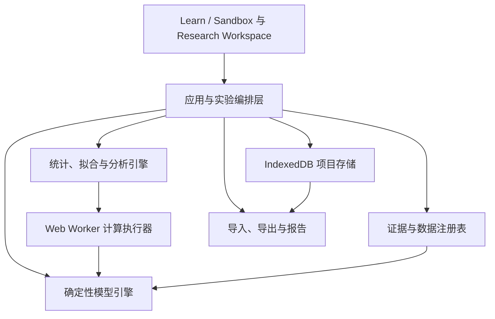

# Ecolab 系统总蓝图

## 1. 项目愿景

Ecolab 是一个本地优先、可审计、可复现的 E. coli–抗生素种群建模系统。它同时提供：

1. **Learn / Sandbox**：通过交互实验理解细菌增长、`zMIC`、药效动力学和模型边界。
2. **Research Workspace**：配置、运行、比较和导出可复现的模拟实验，并逐步支持真实数据导入、参数拟合和模型验证。

项目主要用于个人学习、探索和本科申请作品展示，目标专业方向为生物信息学或应用数学。

### 优先级

1. 科学可信度
2. 数学深度
3. 交互体验

视觉设计、教学质量、研究能力、工程质量和申请展示效果仍是必要目标，但不能以牺牲以上三项为代价。

## 2. 产品定位与声明边界

### 2.1 可以做出的声明

在相应能力实现并验证后，Ecolab 可以被描述为：

- 可复现的研究型模型探索工具；
- 用于理解药效动力学模型的交互式教学系统；
- 用于参数扫描、敏感性分析和不确定性分析的计算工作区；
- 用于将实验数据与指定模型进行比较、校准和验证的平台；
- 展示模型假设、证据来源和适用域的可审计系统。

### 2.2 不可以做出的声明

除非未来获得条件匹配的数据并完成独立验证，否则不得将 Ecolab 描述为：

- 临床决策或患者给药工具；
- 抗生素敏感性 S/I/R 判断工具；
- 已验证的通用 E. coli 实验结果预测器；
- 对任意菌株、培养基、温度或实验流程均有效的数字孪生；
- 可以替代实验、临床标准或专业判断的系统。

### 2.3 科研能力等级

所有界面、导出结果和作品集材料必须标明当前能力等级：

- **L0 — 教学演示**：使用固定的示例参数解释模型行为。
- **L1 — 可复现探索**：记录模型版本、参数、随机种子和运行环境，可重复生成结果。
- **L2 — 不确定性分析**：传播参数不确定性，报告分布、区间和敏感性。
- **L3 — 数据校准**：对条件明确的真实数据拟合参数，并报告残差和可识别性。
- **L4 — 条件内验证**：在未参与拟合的数据上评价模型表现，并明确适用域。
- **L5 — 外部验证**：在独立来源、预先定义条件的数据上验证。

能力等级按**每次分析运行**评估，而不是给整个应用永久贴标签。Learn / Sandbox 的确定性演示运行属于 **L1 — 可复现探索**。第 4 步内置真实数据工作流可以达到 **L3 — 数据校准**，因为它完成固定种子的不确定性/敏感性分析、真实数据拟合和诊断；虽然执行了锁定、无泄漏、未触碰的留出评价，但源孔/板独立性记录不完整，因此不能达到 L4。以上等级都不构成通用真实实验预测或临床能力。

## 3. 严格范围

### 3.1 纳入范围

- 单一、均质环境中的 E. coli 总种群；
- 无药逻辑斯蒂增长；
- 单一抗生素、恒定或用户定义的非临床浓度时间方案；
- 氨苄西林、四环素、环丙沙星；
- Regoes 型药效动力学函数及未来明确登记的替代模型；
- 参数探索、批量模拟、数据比较、拟合、不确定性和敏感性分析；
- 教学课程、挑战、解释、引用和实验报告。

### 3.2 明确不纳入范围

- 患者给药和人体药代动力学；
- 临床 S/I/R 分类或治疗建议；
- 耐药突变与进化；
- 持留菌、异质亚群和适应性耐受；
- 联合用药；
- 空间扩散、菌落结构和生物膜；
- 宿主免疫系统；
- 未经验证的菌株或培养条件外推。

增加以上任一机制都属于未来独立项目决策，不得在普通功能迭代中顺带加入。

## 4. 用户体验结构

### 4.1 Learn / Sandbox

面向大学一年级水平，核心体验包括：

- 无药增长与承载量实验；
- 选择抗生素并以 mg/L 或 `×zMIC` 加药；
- 加药、稀释、洗脱和推进时间；
- 实时种群曲线、浓度曲线和净增长率；
- 在线性和 log10 坐标之间切换；
- 时间点检查器，展示当前参数、公式代入和结果；
- 中英文切换；
- 一条完整的引导式课程，后续再扩展课程体系。

第一阶段教学形式仅锁定为**引导式课程**。挑战、测验和学习进度不作为首个版本要求，除非后续得到明确批准。

### 4.2 Research Workspace

最终目标包括：

- 新建、复制、保存和版本化实验项目；
- 编辑模型参数与实验条件；
- 设计浓度时间方案；
- 单次、批量和参数扫描模拟；
- Monte Carlo 不确定性传播；
- 局部及全局敏感性分析；
- 真实数据导入、条件映射和质量检查；
- 参数拟合、残差分析、可识别性检查；
- 训练数据与验证数据分离；
- 实验组与模型版本比较；
- CSV、JSON、SVG/PNG 和可复现实验包导出；
- 自动生成方法与结果摘要。

研究工作区必须始终区分：文献参数、用户输入参数、拟合参数和派生参数。

## 5. 系统架构

项目采用**本地优先的浏览器应用**，不在初期引入账户或服务器。

### 5.1 模型引擎

职责：

- 实现无 UI 依赖的纯计算函数；
- 明确单位、参数约束和数值边界；
- 为给定输入产生确定性输出；
- 提供版本化模型定义；
- 支持浏览器主线程、Web Worker 和 Node 测试环境。

模型引擎不负责：图表、存储、课程进度、来源展示或文件解析。

### 5.2 分析引擎

职责：

- 参数扫描；
- Monte Carlo 采样；
- 敏感性分析；
- 优化与参数拟合；
- 残差、误差指标和验证统计；
- 随机种子与运行元数据管理。

所有随机分析必须允许固定随机种子。所有优化结果必须保存算法、边界、初始值和停止条件。

### 5.3 证据与数据注册表

职责：

- 保存来源、数据集、实验条件、参数集和许可证元数据；
- 连接每个参数值与其证据；
- 标记条件匹配程度与允许用途；
- 阻止把示例参数或跨条件转移参数误标为验证参数。

具体规则见[科学证据与真实数据](./scientific-evidence-and-data.md)。

### 5.4 应用与实验编排层

职责：

- 管理实验状态和操作历史；
- 统一 Sandbox 与 Research Workspace 的运行请求；
- 验证用户输入；
- 组装可复现实验清单；
- 将长计算分派给 Web Worker。

### 5.5 本地存储与文件格式

- IndexedDB 保存本地项目、课程状态和导入数据；
- 项目必须可导出为人类可读、带 schema version 的 JSON 包；
- 导入旧版本项目时执行显式迁移；
- 不将大型数据或运行结果硬编码进应用源文件；
- 第一阶段不依赖云端账户。

### 5.6 可视化

至少支持：

- 种群随时间变化；
- 药物浓度随时间变化；
- 净增长率随浓度变化；
- 剂量—效应曲线；
- 参数扫描热图或等高线图；
- 不确定性区间；
- 实验数据点、误差条和模型曲线叠加；
- 残差图。

图表必须提供单位、比例尺、数据来源、导出能力和无障碍文本摘要。

## 6. 可复现性契约

每次研究模式运行至少记录：

- 应用版本；
- 模型 ID 与模型版本；
- 参数集 ID、数值、单位和来源；
- 初始状态；
- 实验操作或浓度时间方案；
- 时间范围和数值步长；
- 随机种子；
- 分析算法及设置；
- 数据集 ID 和数据版本；
- 运行时间与结果摘要；
- 适用域警告。

缺少上述关键信息的结果不得标记为可复现研究运行。

## 7. 质量策略

### 7.1 科学与数学测试

- 单元与单位一致性检查；
- 已知解析性质和极限行为；
- 与独立计算或论文示例的交叉核对；
- 数值步长收敛测试；
- 参数约束和非法输入测试；
- 拟合过程的合成数据恢复测试；
- 验证指标的已知样例测试。

### 7.2 软件测试

- 模型和分析函数单元测试；
- 数据 schema 验证测试；
- 项目导入导出往返测试；
- UI 组件测试；
- 关键实验流程端到端测试；
- 中英文缺失键检查；
- 构建、静态检查和可访问性检查。

### 7.3 性能目标

具体数字在实现前通过基准确定。原则是：

- 普通单次模拟交互无可感知延迟；
- 长计算在 Worker 中运行并可取消；
- UI 显示进度和估计工作量；
- 数据量或计算量超过安全阈值时明确提示，不静默冻结页面。

## 8. 五阶段实施计划

一次只执行一个阶段。每个阶段完成后提交成果、验证记录、已知限制和下一阶段建议，并等待项目所有者明确批准。

### 第 1 步：项目蓝图与科学证据规范

**目标：** 确定产品边界、系统架构、科研声明等级、真实数据准入和五阶段路线。

**交付物：**

- `blueprints/README.md`
- `blueprints/ecolab-system.md`
- `blueprints/scientific-evidence-and-data.md`

**完成标准：**

- 双模式产品结构清楚；
- 研究功能与非目标清楚；
- 真实数据和科学声明有可执行规则；
- 后续四步均有明确范围和审批门。

**审批门：** 项目所有者审核并批准蓝图后才能进入第 2 步。

### 第 2 步：科学计算与数据基础

**状态：** 已实施并获项目所有者批准。

**目标：** 将当前原型模型重构为版本化、单位安全、可验证的计算核心，并建立数据 schema。

**计划交付：**

- 明确的模型、参数集、数据集和实验运行 schema；
- 独立模型引擎和时间方案接口；
- 参数/来源注册表；
- 单位与输入验证；
- 数值和科学性质测试；
- 可复现实验 JSON 格式；
- 真实数据研究清单和合法可再分发数据的首批入库方案；
- 修复项目构建与检查基线。

**不包含：** 完整 UI、Monte Carlo、参数拟合和完整教学课程。

**审批门：** 测试通过，参数到来源可追溯，首批数据经过准入审查，模型 API 获得批准。

**实施记录：** `npm run check` 与 `npm run build` 已通过；参数精确定位到 BioNumbers 111767/Campos p.1439 与 Regoes 2004 Equation 3、Figures 2–3、Table 1；真实数据候选已完成许可初筛，但没有候选同时满足匹配条件、机器可读原始数据和明确再分发许可，因此当前未内置实验数据。

### 第 3 步：完整交互垂直切片

**状态：** 已实施并获项目所有者批准。

**目标：** 交付可部署、可展示的 Learn / Sandbox，并贯通本地项目与导出流程。

**计划交付：**

- 响应式中英文应用框架；
- 三种抗生素的交互实验；
- 多图联动和公式检查器；
- 加药、稀释、洗脱、暂停、重置和时间控制；
- 本地保存、恢复与实验导出；
- 来源与限制面板；
- 一条大学一年级水平的引导式课程；
- 关键流程端到端测试。

**不包含：** 完整拟合和高级不确定性工作区。

**审批门：** 可完成一条端到端学习与沙盒流程，科学说明和导出均正确，构建及测试通过。

**实施记录：** 已实现响应式中英文 `#/learn` 与 `#/sandbox`；支持无药对照和三种抗生素、`mg/L`/`×zMIC`、加药、只稀释药物浓度、洗脱、播放/暂停/推进/重置、三联 SVG 图表、边界感知公式检查器、来源与限制、操作时间线、可访问分页数据表、IndexedDB/内存回退、JSON/CSV/SVG 严格导出和七步课程。构建输出拆分为 `dist/core/` 与 `dist/web/`。`npm run check`、37 项测试和 `npm run build` 通过。Safari WebDriver 会话因当前机器未启用 Allow remote automation 被系统阻止。该记录描述第 3 步获批时的状态；后续第 4 步实施见下一节。

### 第 4 步：研究工作区与真实数据分析

**状态：** 已实施、完成内部审计并获项目所有者批准。

**目标：** 实现深度研究真实数据、批量模拟、不确定性、敏感性、拟合和条件内验证。

**计划交付：**

- CSV/JSON 数据导入和质量检查；
- 内置、可合法分发、版本化的真实数据集；
- 实验条件映射与匹配评分；
- 参数扫描与批量任务；
- Monte Carlo 不确定性传播；
- 敏感性分析；
- 参数拟合、残差、可识别性提示；
- 训练/验证拆分和验证指标；
- Worker 任务、进度和取消；
- 可复现研究包与方法摘要导出。

**审批门：** 使用至少一个真实、条件明确的数据集完成可重复的导入—拟合—验证流程；结果不作超范围声明。

**实施记录：** 已实现中英文 `#/research` 的 Data、Design、Analysis、Results 四段流程；规范 JSON/CSV 导入、显式 CSV 元数据、质控与逐字段条件比较；内置 Figshare `10.6084/m9.figshare.28342064.v1` 的 CC BY 4.0 BW25113 未处理 OD600 子集，并以 SHA-256 验证精确标准化文件；按 8 条完整训练轨迹和 4 条完整验证轨迹拆分；使用显式 `OD600 = baselineOd + scaleOd × (N/K)` 观测层，只在训练数据上剖面化干扰参数；拟合 `psiMaxLog10PerHour` 和已声明 pooled 初始状态，同时固定承载量；实现参数扫描、固定种子 Monte Carlo、局部/Morris/Sobol–Jansen 敏感性、残差、指标、可识别性、预声明基线和锁定验证；专用 Worker 支持进度与终止取消；IndexedDB v2 保存数据集和分析；导出 manifest、研究包、规范数据、预测/残差/指标、方法 Markdown 和 SVG。当前真实数据运行达到 L3，验证表现差于预声明训练均值基线时如实显示；源孔/板独立性记录不足，因此 L4 明确不合格。构建排除 `data/raw/` 和 `.xlsx`。详细方法见 [`docs/research-workspace.md`](../docs/research-workspace.md)。

**批准状态：** 项目所有者已明确批准第 4 步，并要求开始第 5 步。

### 第 5 步：完善、审计与作品集发布

**状态：** 发布/作品集线已实施，自动化审计通过；最终公开发布 in progress。

**目标：** 将系统提升为稳定、可访问、可解释且适合大学申请展示的长期项目版本。

**计划交付：**

- 科学与代码审计；
- 完整文档和方法说明；
- 教学内容完善；
- 性能、可访问性和跨浏览器优化；
- 示例研究与可复现实验包；
- 中英文项目介绍、架构说明和局限性说明；
- 作品集案例叙事和部署版本；
- 维护、版本和数据更新流程。

**Stage 5 验收清单：**

- [x] 科学语义一致：锁定留出评价、验证证据资格和 L3/L4 字段不冲突；方法、SVG、UI 和文档保留关键警告与来源。
- [x] 资源边界明确：文件在读取前检查大小；Sandbox 在分配采样点前执行时间与采样数量硬限制；Worker 可取消且具有超时保护。
- [x] 可访问交互的自动化契约：路由、语言、tab、面板和结果切换具有确定焦点；进度/取消状态可读；表格、SVG 和热图具有非色彩替代；暗色关键语义色通过计算对比度测试，reduced motion 会阻止/暂停自动播放。
- [x] 持久化和格式契约：IndexedDB 升级使用显式 migration；运行清单、研究包、spreadsheet-safe CSV 与机器交换格式的语义清楚；导出就绪条件与实际依赖一致。文件形式的 Sandbox project import/export round trip 明确不作为当前能力声明。
- [x] 可复现发布：应用版本具有单一来源检查；测试构建不污染正式 `dist/`；两次干净构建内容一致；发布包有 SHA-256 清单且排除 `data/raw/`、`.xlsx` 与 tests。
- [x] 作品集材料：提供中英文项目介绍、架构、方法、限制、维护与数据更新流程；版本化 L3 示例研究保留差于基线的验证结果和 L4 边界。
- [x] 自动化验证收尾：完整 `npm run build`（含 238 项自动化测试）、`npm run test:release`、`npm run audit:data`、`npm run audit:release`、示例重放和复现检查通过。
- [ ] 人工发布验收：Chrome、Firefox、Safari 工作流/键盘/窄屏检查与浏览器交互 P95 尚未完成；Safari WebDriver 需要项目所有者在系统设置启用 Allow remote automation。

**实施记录：** 应用发布版本升级到 `5.0.0`，根 package 成为唯一版本来源；科学核心 `2.0.0` 与分析引擎 `1.0.0` 保持不变。构建支持临时 `--out-dir`，发布审计覆盖 Markdown 相对链接、inline event handler、版本、产物内容、禁止路径、大小预算、CSP 和排序 SHA-256 manifest；两次干净临时构建按文件内容哈希一致。版本化 small-preset artifact 由 bundled dataset 实际生成，明确显示 L3、L4 不合格及验证差于预声明基线。完整 `npm run build` 的 238 项测试、正式构建与 release audit 通过；最终公开发布仍需处理人工浏览器与性能验收项。

**审批门：** 所有公开声明均有证据支持；核心流程通过测试；示例研究可由干净环境复现；项目所有者批准发布。

## 9. 主要风险与控制

| 风险 | 控制措施 |
|---|---|
| 把跨条件参数当作真实预测 | 条件匹配评分、显著警告、能力等级与导出声明 |
| 为追求界面效果弱化科学限制 | 科学声明作为数据和 UI 的强制字段，不允许隐藏 |
| 真实数据来源或许可不清 | 入库前许可审查，只内置允许再分发的数据 |
| 模型逐渐超出严格范围 | 非目标清单和变更审批门 |
| 拟合结果看似精确但不可识别 | 区间、相关性、诊断和合成数据恢复测试 |
| 浏览器批量计算冻结界面 | Web Worker、取消、进度和任务限额 |
| 本地项目格式演变导致数据丢失 | schema version、迁移和往返测试 |
| 申请材料过度宣传 | 公开声明清单、证据链接和限制说明 |

## 10. 当前决策与待定项

### 已确定

- 双模式：Learn / Sandbox + Research Workspace；
- 本地优先浏览器架构；
- 中英文切换；
- 教学起点为大学一年级；
- 深度研究并内置真实数据；首个数据包为 Figshare BW25113 未处理 OD600、CC BY 4.0；
- 研究能力包括导入、拟合、敏感性、不确定性和锁定留出评价；能力按运行评估；
- 严格保持现有生物机制范围；
- 五步推进且每步需要明确批准。

### 后续阶段决定

以下问题在相应阶段用证据和原型决定，不在第 1 步提前锁死：

- UI 框架、图表库和状态管理库；
- 单位系统的具体实现方式；
- 后续内置抗生素暴露或外部验证数据集；
- 是否在未来科学版本调整或新增优化、采样和敏感性算法；
- 是否在具备浏览器测量协议后增加交互延迟预算；
- 最终公开部署平台。
