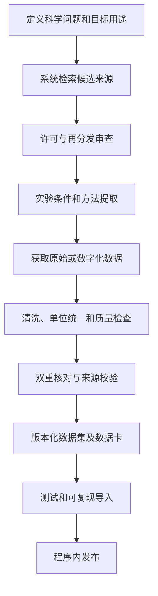

# 科学证据与真实数据蓝图

## 1. 目的

本蓝图定义 Ecolab 如何研究、选择、保存和使用真实数据，以及如何将数据、模型参数、计算结果和公开声明连接为可审计证据链。

系统追求科学可信度，但不通过堆积来源或显示更多小数位制造虚假精确性。每个结论都必须说明：

- 使用了什么数据；
- 数据在什么条件下产生；
- 使用了什么模型和参数；
- 做了哪些处理；
- 结论在哪个适用域内成立；
- 存在哪些不确定性和限制。

## 2. 证据对象

Ecolab 将以下对象分开管理：

### 2.1 来源 Source

论文、数据库记录、标准、政府标签、数据仓库或方法文件。来源是引用对象，不等同于可计算数据集。

### 2.2 数据集 Dataset

包含可计算观测值及实验元数据的版本化对象。一个来源可以产生多个数据集版本。

### 2.3 参数集 Parameter Set

一组带单位、来源、估计方法、条件和不确定性的模型参数。参数集不得只保存数值。

### 2.4 模型定义 Model Definition

包括方程、状态变量、参数语义、单位、初始条件、数值方法和明确假设的版本化对象。

### 2.5 分析运行 Analysis Run

对模型、参数集和数据集执行的模拟、扫描、采样、拟合或验证任务。

### 2.6 科学声明 Scientific Claim

用户界面、报告或作品集中出现的可验证表述。声明必须连接到支持它的来源、数据和分析运行。

## 3. 证据等级

来源类型本身不能自动保证某个具体用途有效。Ecolab 使用以下等级描述证据与当前用途的关系：

- **E0 — 教学假设**：为展示行为设置，未直接来自测量。
- **E1 — 权威背景**：标准、数据库或政府资料支持定义、机制或方法背景。
- **E2 — 同行评议测量**：来自明确实验的测量值，但可能与当前目标条件不匹配。
- **E3 — 条件匹配数据**：菌株、培养基、温度、暴露和观测定义与当前分析基本匹配。
- **E4 — 校准证据**：用于拟合当前模型的数据，并保存完整拟合诊断。
- **E5 — 独立验证证据**：未参与拟合、来自预先指定验证流程的数据。

同一来源对不同声明可以处于不同等级。例如，药品标签可作为作用机制的 E1 证据，但不能作为特定培养条件下杀菌速率的证据。

## 4. 条件描述与匹配

每个真实数据集和参数集必须尽可能记录：

- 生物种、菌株和菌株标识；
- 基因型或重要表型；
- 培养基及补充成分；
- 温度、pH、氧合和培养方式；
- 生长阶段与预培养条件；
- 初始接种量及单位；
- 容器、体积、振荡或微流控条件；
- 抗生素名称、盐型、浓度和单位；
- 暴露方案和采样时间；
- 测量对象：CFU、OD、细胞数或其他；
- 检测下限、定量下限和删失规则；
- 生物重复与技术重复；
- 原始值、汇总值及误差含义；
- 数据处理和单位转换。

### 4.1 条件匹配状态

系统至少显示以下状态，不用单一分数掩盖关键差异：

- **Matched**：关键条件与目标分析一致；
- **Partially matched**：存在已知差异，但用途和影响已说明；
- **Transferred calibration**：参数从不同系统转移，仅用于探索；
- **Unknown**：关键元数据缺失；
- **Incompatible**：关键定义或条件冲突，不应直接拟合或验证。

可以提供辅助匹配分数，但必须同时展示逐字段差异。

### 4.2 当前参数的状态

现有模型将 BW25113/M9 无药增长基线与 CAB1/LB 抗生素药效参数组合。该组合必须标记为：

- `Transferred calibration`；
- 适合教学和研究型探索；
- 不构成 BW25113/M9 抗生素暴露的匹配测量或验证预测。

## 5. 真实数据准入流程

“深度研究真实数据并放进程序内”必须通过以下流程完成。



### 5.1 定义问题

检索前必须确定数据用途，例如：

- 无药增长基线；
- 某抗生素的剂量—效应关系；
- 固定浓度下的时间—杀菌曲线；
- 用于拟合；
- 用于独立验证；
- 仅用于教学背景。

不得先收集容易找到的数据，再反向创造不恰当用途。

### 5.2 来源优先级

优先搜索：

1. 带稳定标识、元数据和许可证的数据仓库；
2. 同行评议论文的开放补充数据；
3. 权威数据库中的原始或结构化记录；
4. 可验证的作者公开数据；
5. 只能从图中数字化的数据。

图表数字化数据必须标明数字化工具、操作者、图号、坐标转换和额外误差，不得伪装成作者提供的原始数据。

### 5.3 许可与再分发

数据内置程序前必须记录：

- 版权人或发布者；
- 许可证或使用条款；
- 是否允许再分发和修改；
- 引用要求；
- 获取日期和原始 URL；
- 必要时仅保存下载脚本或外部引用，而不打包数据本体。

“公开可访问”不自动等于“允许重新打包”。许可不明确的数据不得默认内置。

### 5.4 数据获取等级

按优先顺序区分：

- `author_original`：作者或仓库提供的原始数据；
- `author_processed`：作者提供的处理后数据；
- `database_export`：权威数据库导出；
- `digitized_figure`：从图中数字化；
- `manual_transcription`：从表格人工录入。

人工录入和数字化必须至少经过一次独立核对。

### 5.5 清洗原则

- 原始文件只读保存，不原地覆盖；
- 清洗步骤由脚本执行，而非只在电子表格中手工处理；
- 保留缺失、删失和检测下限信息；
- 不在没有依据时把 `≤LOD` 当作 LOD、0 或 LOD/2；
- OD 与 CFU 不得无校准地互换；
- mg/L 与 µg/mL 数值相等仍需保存原单位和转换记录；
- 重复实验不得只保留均值而丢失原始重复；
- 异常值不得静默删除；
- 所有派生列记录公式和软件版本。

### 5.6 发布要求

每个内置数据集必须包含：

- 机器可读数据文件；
- schema version；
- 数据卡；
- 来源和许可；
- 获取及处理脚本；
- 校验和；
- 自动验证测试；
- 适用用途和禁止用途；
- 已知问题。

## 6. 数据卡最低内容

每个数据集应提供中英文可展示字段：

- 数据集标题和稳定 ID；
- 数据版本与发布日期；
- 简要说明；
- 原始来源、DOI/PMID/仓库标识和 URL；
- 许可证；
- 生物学和实验条件；
- 样本、重复和测量方法；
- 列定义与单位；
- 清洗与转换历史；
- 检测下限和缺失值语义；
- 质量警告；
- 条件匹配状态；
- 允许分析用途；
- 不允许的外推；
- 维护者和最后审核日期。

## 7. 参数注册与溯源

每个参数至少记录：

- 参数 ID 和人类可读名称；
- 模型版本；
- 数值与单位；
- 点估计、区间或分布；
- 参数边界；
- 来源 ID 或数据集 ID；
- 估计方法；
- 适用菌株和实验条件；
- 证据等级；
- 条件匹配状态；
- 审核日期；
- 是否可由用户覆盖。

不得只引用一篇论文却无法指出数值来自哪张表、哪个图、哪一行或哪段方法。

### 7.1 参数来源类型

界面和导出中明确显示：

- `literature`：文献或数据库直接提供；
- `derived`：由有来源的量数学转换；
- `fitted`：由指定数据集拟合；
- `user`：用户输入；
- `educational_assumption`：教学假设；
- `transferred`：从不同条件转移。

## 8. 模型校准

### 8.1 校准前要求

- 明确观测模型，例如预测 CFU 还是 log10 CFU；
- 明确误差模型；
- 明确检测下限和删失处理；
- 指定拟合参数、固定参数、参数边界和先验或初值；
- 检查数据量是否足以支持拟合参数数量；
- 保留未参与拟合的数据用于验证，或明确说明无法独立验证。

### 8.2 必须报告

- 目标函数或似然；
- 优化或采样算法；
- 初始值、边界、停止条件和随机种子；
- 最优参数及不确定性；
- 参数相关性或可识别性诊断；
- 预测与观测叠加；
- 残差图；
- 失败运行和多起点结果；
- 数据和模型版本。

### 8.3 防止过拟合

- 参数数量相对数据量必须合理；
- 优先拟合科学上可识别的参数；
- 使用合成数据测试参数恢复；
- 对多个候选模型使用预先定义的比较标准；
- 不用训练误差冒充预测能力；
- 复杂模型只有在证据支持时才加入。

## 9. 模型验证

### 9.1 软件验证不等于科学验证

以下测试只能证明实现符合指定数学行为：

- zMIC 处净增长率为零；
- 高浓度极限接近 `psiMin`；
- 种群不超过承载量；
- 相同输入产生相同输出。

它们不能证明模型能预测真实 E. coli 实验。

### 9.2 科学验证层次

1. **内部一致性**：方程、单位和数值实现正确。
2. **校准后检验**：模型描述用于拟合的数据，但不声称外部预测能力。
3. **留出验证**：在同来源的独立时间点、剂量或重复上评价。
4. **条件内独立验证**：在未用于拟合但条件匹配的数据集上评价。
5. **外部验证**：在独立实验室或独立来源上评价。

### 9.3 评价维度

根据分析目的选择并预先声明：

- RMSE 或 MAE；
- log10 CFU 误差；
- 偏差和校准；
- 区间覆盖率；
- 趋势或排序是否正确；
- 关键阈值或时间点误差；
- 残差结构；
- 对实验重复变异的相对表现。

不得只挑选对模型最有利的指标。

## 10. 不确定性与敏感性

### 10.1 不确定性来源

至少区分：

- 参数不确定性；
- 测量误差；
- 实验重复差异；
- 数值误差；
- 模型结构不确定性；
- 条件转移不确定性。

当前模型中的跨菌株/培养基转移属于结构和条件不匹配，不能只靠给参数加一个标准误就完全表达。

### 10.2 Monte Carlo

每次运行记录：

- 参数分布和相关性假设；
- 样本量；
- 采样方法；
- 随机种子；
- 失败样本处理；
- 收敛或稳定性检查。

图中使用“模拟区间”或“参数不确定性区间”等准确名称，除非统计含义确实支持，否则不随意称为置信区间。

### 10.3 敏感性分析

- 局部敏感性适合解释邻域变化；
- 全局敏感性用于宽参数空间；
- 参数范围必须有证据或明确标为探索范围；
- 相关参数不能在未经说明时假设独立；
- 输出指标和时间窗必须预先定义。

## 11. 程序内的科学透明度

### 11.1 结果徽章

每个结果至少显示：

- 模型版本；
- 科研能力等级 L0–L5；
- 参数来源类型；
- 条件匹配状态；
- 是否使用真实数据；
- 是否完成独立验证；
- 关键警告数量。

### 11.2 警告不可隐藏

以下警告必须出现在结果视图和导出文件中：

- 跨菌株或培养基参数转移；
- 关键实验条件未知；
- 数据只来自图表数字化；
- 许可限制；
- 拟合参数不可识别；
- 在训练数据上报告的表现；
- 超出参数或数据适用范围的模拟。

### 11.3 数字精度

显示精度由测量和参数不确定性决定。派生计算不得因为软件能输出更多位数就展示虚假精确性。

## 12. 内置数据目录

第 4 步已按以下结构准入首个可再分发真实数据集：

```text
data/
├── registry/
│   ├── sources.json
│   ├── datasets.json
│   └── parameter-sets.json
├── datasets/
│   └── <dataset-id>/
│       ├── data.csv
│       ├── dataset.json
│       ├── README.md
│       └── checksums.json
└── raw/
    └── <dataset-id>/
```

原始数据是否进入发布包取决于许可证。无法再分发时，可以保存获取说明、下载工具和校验和，但不得绕过来源条款。

## 13. 深度研究计划与第 4 步结果

第 2 步建立 schema、检索问题和准入测试后，第 4 步完成了首个真实数据准入和研究工作流。已内置：

- `figshare-bw25113-growth-v1@1.0.0`；
- DOI `10.6084/m9.figshare.28342064.v1`；
- CC BY 4.0；
- BW25113、未处理、`Cond00003`、原始未扣空白 OD600；
- 528 个观测、12 条完整轨迹；
- 8 条训练轨迹和 4 条锁定留出轨迹；
- 获取、XLSX 解析、确定性提取、数据卡、校验和和自动审计。

该数据只承担明确受限的 OD600 校准用途。它不匹配当前补充 M9 培养基，不含抗生素处理，也不能被当作直接 CFU 观测或 L4 验证证据。

后续仍需系统调查：

1. BW25113 在明确 M9 条件下的无药时间序列；
2. 三种目标抗生素对 E. coli 的浓度—效应或时间—杀菌数据；
3. 是否存在菌株、培养基、温度和测量单位与模型目标条件匹配的数据；
4. 数据许可证是否允许程序内再分发；
5. 哪些数据只能用于背景、校准或独立验证；
6. 数据是否足以识别当前药效模型参数。

研究结果必须包含候选数据集清单、排除理由和证据缺口，不能只记录最终选中的数据。

## 14. Stage 5 发布证据（历史 5.0.0）

Stage 5 没有改变模型、参数或分析算法语义。应用版本升级为 `5.0.0`，科学核心保持 `2.0.0`，分析引擎保持 `1.0.0`。发布线新增：

- 根 package 版本一致性检查；
- 临时目录构建和两次干净构建内容哈希比较；
- 禁止 `data/raw/`、`.xlsx` 与 tests 的产物审计；
- 静态字节预算和排序 SHA-256 manifest；
- 由 bundled dataset 实际生成的版本化 small-preset 作品集 artifact。

该 artifact 是当时 Stage 4 工作流的发布记录，不是新的科学证据层级；历史文件不重写。当前升级案例见 [Portfolio case study](../docs/portfolio-case-study.md)，最新工程验证见 [发布检查表](../docs/release-checklist.md)。

### B 方案 6.0.0 的科学契约更新

应用 `6.0.0` / 分析 `2.0.0` 保留教学核心和数据，增加直接 OD 经验模型的训练整轨迹 CV、联合 bootstrap、显式同版复算。论文方法与观测尺度改写必须在 [方法证据](../docs/research-method-evidence.md) 中区分，不得把 OD 形状参数称为已测生理参数。

原留出曲线已经查看，当前是开发集比较，不是未触碰或外部验证；同管分孔、轨迹标签不认证独立实验。工程三角范围、Morris 全边界、Sobol 配对行采样误差及联合整曲线 bootstrap 有不同含义。目标函数切片不是真 profile likelihood，秩亏伪逆不报告为校准协方差。

完成、收敛、识别和精度独立报告。小预算示例选中均值基线，参数化模型未收敛，不宣称方法改进或稳定排名。研究包只允许精确内置代码显式复算，核对科学投影和完整 manifest；完整性不是真实性或实验有效性。

新增论文候选的实际取得状态和排除原因见 [数据准入审查](../docs/data-candidate-review.md)；没有新三药数据通过准入。

## 15. 当前已知证据缺口

- 当前没有同一菌株、同一培养基下同时覆盖无药增长和三种抗生素暴露的内置时间序列；
- 当前没有匹配补充 M9 目标的批量 OD/CFU 动态数据；
- 当前 Figshare 数据是 OD600，缺少经过验证的 OD→绝对 CFU/mL 转换；
- 当前 Figshare 数据不含抗生素处理，不能验证三种药物的药效参数；
- 当前孔/板身份和独立性记录不足，且原留出已查看，使本版开发比较不具备 L4 资格；
- 当前承载量不能由原始 OD600 绝对尺度识别，仍从解析模型固定；
- 当前药物参数仍来自 CAB1/LB 转移校准；
- 当前没有独立来源的外部验证数据；
- 当前探索参数区间不是统计置信区间，结构与条件转移不确定性仍不能被简单标准误完全表达。

已解决的旧缺口包括：参数精确来源定位、真实观测 schema、许可证与再分发字段、数据处理脚本、校验和、真实数据拟合、残差/可识别性诊断以及形式上锁定的留出评价。仍然存在的缺口必须随结果和导出保留。

## 16. 第 1 步审批检查表

- [x] 区分来源、数据集、参数集、模型和分析运行。
- [x] 定义证据等级和科研能力等级。
- [x] 记录当前跨条件校准的限制。
- [x] 定义真实数据许可、准入、清洗和发布流程。
- [x] 定义参数拟合、验证、不确定性和敏感性基本规则。
- [x] 定义程序内必须展示的科学警告。
- [x] 明确真实数据深度研究将在第 2 步建立基础并在第 4 步形成完整工作流。
