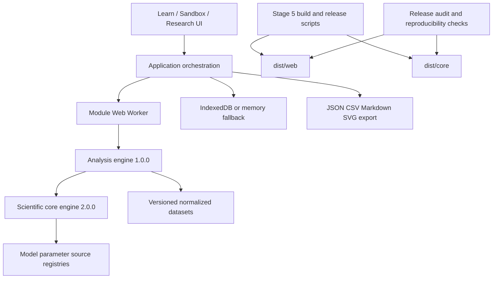

# Architecture / 系统架构

## 中文

### 设计原则

- **本地优先**：浏览器应用、IndexedDB、静态部署，无账户或后端要求。
- **科学语义集中**：UI 不复制方程；模型、注册表、实验清单和分析层保持独立。
- **可审计输入输出**：版本、来源、数据哈希、随机种子、参数边界、指标和警告进入 manifest 或研究包。
- **发布与科学版本分离**：应用 `5.0.0`、科学核心 `2.0.0`、分析引擎 `1.0.0` 各自表达不同契约。



### 主要边界

| 层 | 位置 | 职责 |
| --- | --- | --- |
| 浏览器应用 | `src/app/` | 路由、交互、可视化、Worker 调度、存储与导出 |
| 科学核心 | `src/model/`, `src/model.js` | 单种群模型、单位、协议和确定性模拟 |
| 分析层 | `src/analysis/`, `src/analysis.js` | 数据导入、拟合、指标、验证、不确定性和敏感性 |
| 注册表与实验 | `src/registry/`, `src/experiment/` | 版本解析、来源连接和运行清单 |
| 数据与 schema | `data/`, `schemas/` | 版本化数据、注册表、许可证、校验和与交换契约 |
| 发布线 | `scripts/` | 构建、数据审计、发布审计、复现检查和案例生成 |

默认构建目标保持：

```text
dist/core/   scientific-core package
dist/web/    deployable static application
```

`build-core.js` 和 `build-web.js` 同时接受 `--out-dir`，测试和复现脚本将输出放入临时目录，不污染正式 `dist/`。URL 与模块导入验证直接在实际目标目录执行，因此临时路径和默认路径使用相同验证规则。

### 发布安全

`build-web.js` 把 `_headers` 部署配置复制到 Web 产物。CSP：

- 不使用 `unsafe-inline`；
- 允许同源 ES module 与同源 module Worker；
- 允许应用创建 `blob:` 下载；
- 禁止 object、跨站 frame ancestor 和未声明资源源；
- 对现有四个受控 CSS 自定义属性内联值使用精确 `unsafe-hashes`，而不是开放任意内联样式。

部署细节见 [Deployment](./deployment.md)。科学结构和长期决策的权威记录仍是 [系统总蓝图](../blueprints/ecolab-system.md)。

## English

### Principles

- **Local-first**: browser application, IndexedDB, and static hosting, with no account or backend requirement.
- **Centralized scientific semantics**: the UI does not duplicate equations; model, registry, experiment-manifest, and analysis layers remain separate.
- **Auditable inputs and outputs**: versions, provenance, data hashes, seeds, parameter bounds, metrics, and warnings enter manifests or research packages.
- **Separate release and scientific versions**: application `5.0.0`, scientific core `2.0.0`, and analysis engine `1.0.0` express different contracts.

The browser UI delegates long analysis work to a same-origin module Worker. The analysis engine calls the deterministic scientific core and consumes explicit registries and versioned normalized data. IndexedDB stores local work; exports remain portable files.

`build-core.js` and `build-web.js` preserve the default `dist/core/` and `dist/web/` outputs while accepting `--out-dir`. Tests and reproducibility checks build into temporary directories and run the same import and relative-URL validation there.

The Web build carries `_headers` into the release. Its CSP avoids `unsafe-inline`, permits same-origin module Workers and `blob:` downloads, and uses exact style hashes only for the four controlled inline CSS custom-property values already emitted by the application.

See [Deployment](./deployment.md) for hosting requirements and the [system blueprint](../blueprints/ecolab-system.md) for long-term decisions.
