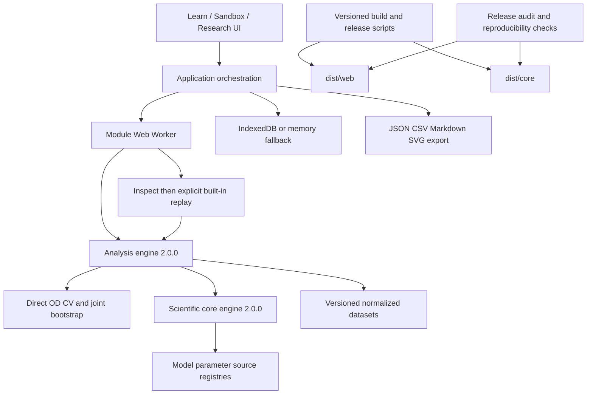

# Architecture / 系统架构

## 中文

### 设计原则

- **本地优先**：浏览器应用、IndexedDB、静态部署，无账户或后端要求。
- **科学语义集中**：UI 不复制方程；模型、注册表、实验清单和分析层保持独立。
- **可审计输入输出**：版本、来源、数据哈希、随机种子、参数边界、指标和警告进入 manifest 或研究包。
- **发布与科学版本分离**：应用 `6.0.0`、科学核心 `2.0.0`、分析引擎 `2.0.0` 各自表达不同契约。



### 主要边界

- 浏览器应用 `src/app/`：路由、交互、可视化、Worker 调度、存储与导出。
- 科学核心 `src/model/`、`src/model.js`：单种群模型、单位、协议和确定性模拟。
- 分析层 `src/analysis/`、`src/analysis.js`：导入、拟合、指标、CV、开发比较、不确定性和敏感性。
- 注册表与实验 `src/registry/`、`src/experiment/`：版本解析、来源连接和运行清单。
- 数据与 schema `data/`、`schemas/`：版本化数据、许可、校验和与严格交换契约。
- 发布线 `scripts/`：构建、数据/发布审计、复现检查和实际案例生成。

### 研究与回放信任边界

`runEcolabResearchWorkflow()` 接收显式源文本和解析模型；`growth-comparison.js` 只在训练轨迹上选模与重采样，`research-upgrade.js` 封装开发标签和完整输入工件。教学参数与原始数据不因升级而重写。

`inspectResearchPackage()` 同步检查安全 JSON、字节/SHA、inventory 与输入关联，不执行数值任务。`replayResearchPackage()` 仅在精确兼容的内置实现中显式运行，并比较科学投影和完整分析 manifest；哈希检查本身不证明科学结论或来源真实性。旧包缺完整输入时仅查看。包导入最多 32 MiB / 64 artifacts / 深度 64 / 100 万 JSON 值，并限制数值预算；不加载导入代码，不联网获取依赖。

UI 通过 `research.package-inspect` / `research.package-replay` Worker 任务处理包；`replayPreview` 仅内存、无当前数据集关联，不覆盖已存结果。恢复分析严格匹配数据集 id、revision、contentHash。IndexedDB 仅初始化不可用时退化为易失内存，运行时配额失败显式报错，不静默切库。

前端固定资源可从静态站点加载，分析与用户数据处理在本地；本地存储不是云备份。

默认构建目标保持：

```text
dist/core/   scientific-core package
dist/web/    deployable static application
```

`build-core.js` 和 `build-web.js` 同时接受 `--out-dir`，测试和复现脚本将输出放入临时目录，不污染正式 `dist/`。URL 与模块导入验证直接在实际目标目录执行，因此临时路径和默认路径使用相同验证规则。

### 发布安全

`build-web.js` 把 `_headers` 部署配置复制到 Web 产物。CSP：

- 不使用 `unsafe-inline`；
- 允许同源 ES module 与同源 module Worker；
- 允许应用创建 `blob:` 下载；
- 禁止 object、跨站 frame ancestor 和未声明资源源；
- 对现有四个受控 CSS 自定义属性内联值使用精确 `unsafe-hashes`，而不是开放任意内联样式。

部署细节见 [Deployment](./deployment.md)。科学结构和长期决策的权威记录仍是 [系统总蓝图](../blueprints/ecolab-system.md)。

## English

### Principles

- **Local-first**: browser application, IndexedDB, and static hosting, with no account or backend requirement.
- **Centralized scientific semantics**: the UI does not duplicate equations; model, registry, experiment-manifest, and analysis layers remain separate.
- **Auditable inputs and outputs**: versions, provenance, data hashes, seeds, parameter bounds, metrics, and warnings enter manifests or research packages.
- **Separate release and scientific versions**: application `6.0.0`, scientific core `2.0.0`, and analysis engine `2.0.0` express different contracts.

The browser UI delegates analysis and exact-version replay to same-origin module Workers. Training-only direct-OD comparison is separate from the unchanged teaching core. Imported packages cannot supply executable code or fetch dependencies. Replay compares both scientific output and the full manifest; a memory-only preview never replaces saved analyses. IndexedDB restoration checks dataset ID, revision and content hash. Initialization fallback is volatile; runtime storage failures remain explicit.

`build-core.js` and `build-web.js` preserve the default `dist/core/` and `dist/web/` outputs while accepting `--out-dir`. Tests and reproducibility checks build into temporary directories and run the same import and relative-URL validation there.

The Web build carries `_headers` into the release. Its CSP avoids `unsafe-inline`, permits same-origin module Workers and `blob:` downloads, and uses exact style hashes only for the four controlled inline CSS custom-property values already emitted by the application.

See [Deployment](./deployment.md) for hosting requirements and the [system blueprint](../blueprints/ecolab-system.md) for long-term decisions.
